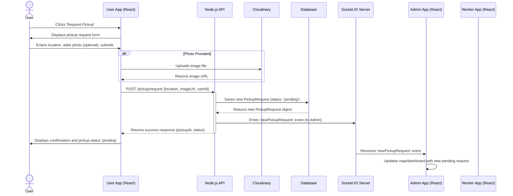
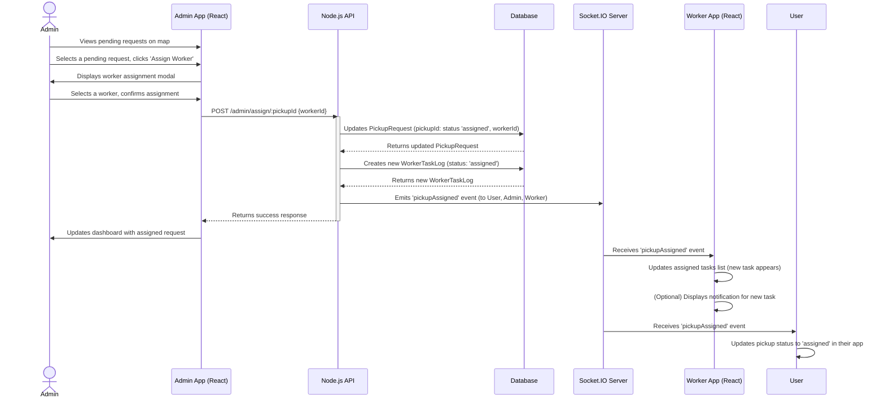

# UML Sequence Diagrams

This section details the interaction sequences for two core functionalities: User Requesting a Pickup and Admin Assigning a Pickup to a Worker.

## 1. User Request Pickup Flow

## 2. Admin Assigns Pickup to Worker Flow

