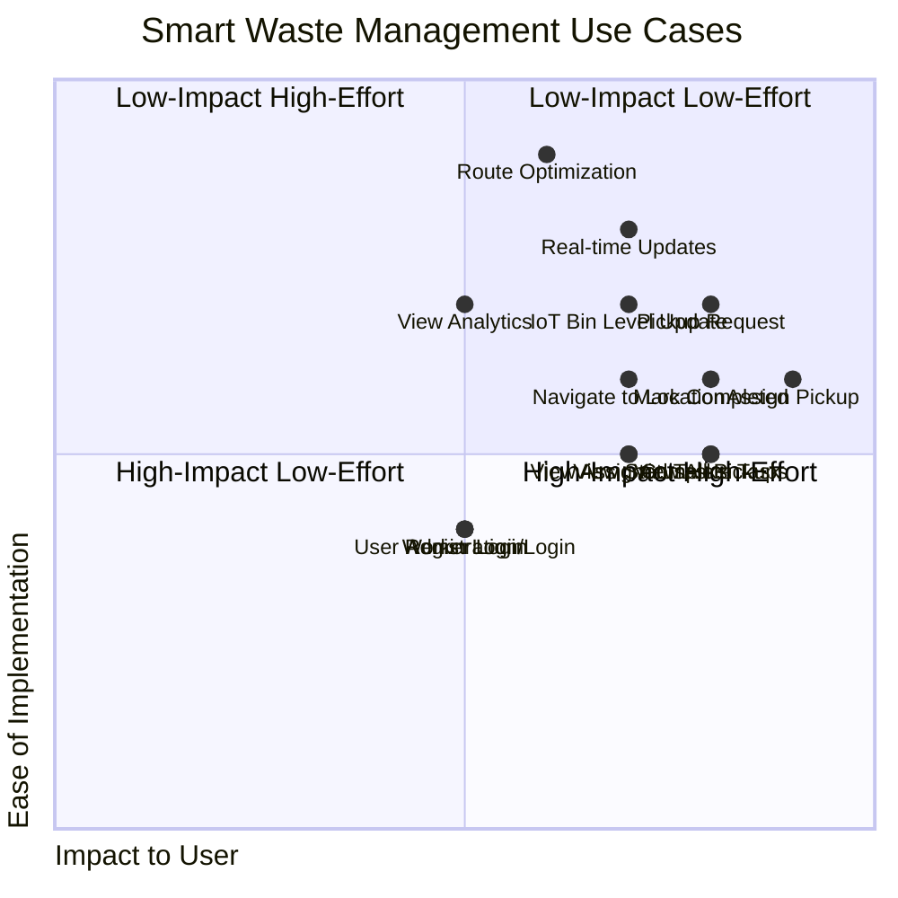

# UML Use Case Diagram

This section describes the main use cases for each actor (User, Admin, Worker, and the optional IoT Device) within the system.

## Actors:

*   **User:** An individual who needs to request garbage pickup.
*   **Admin:** Manages pickup requests, assigns workers, and monitors the system.
*   **Worker:** Performs garbage collection tasks.
*   **IoT Device (Optional):** A smart dustbin that reports fill levels.

## Use Cases:

### User Use Cases:

1.  **Register/Login:** Users can create an account and log into the system.
2.  **Request Pickup:** Users can initiate a garbage pickup request, providing their location and an optional photo.
3.  **View Pickup Status:** Users can track the real-time status of their requested pickups.
4.  **View Nearby Dustbins:** Users can see the fill levels of smart dustbins in their vicinity (if IoT is integrated).

### Admin Use Cases:

1.  **Login:** Admin can log into the system.
2.  **View All Pickup Requests:** Admin can view all pending, assigned, in-progress, and completed pickup requests on an interactive map.
3.  **Assign Worker to Pickup:** Admin can select a pickup request and assign it to an available worker.
4.  **Optimize Worker Route:** Admin can trigger an optimization process to generate an efficient route for workers.
5.  **View Analytics:** Admin can access daily/weekly reports and analytics related to pickups and worker performance.
6.  **Monitor Dustbin Fill Levels:** Admin can view real-time fill levels of smart dustbins (if IoT is integrated).

### Worker Use Cases:

1.  **Login:** Workers can log into the system.
2.  **View Assigned Tasks:** Workers can see a list of pickup tasks assigned to them.
3.  **View Task Details:** Workers can view detailed information about an assigned task, including location and user notes.
4.  **Navigate to Location:** Workers can get directions to the pickup location via a maps link.
5.  **Mark Pickup as In Progress:** Workers can update the status of a task to 'in_progress' when they start a pickup.
6.  **Mark Pickup as Completed:** Workers can mark a task as 'completed' after successfully collecting the garbage.

### IoT Device Use Cases (Optional):

1.  **Send Fill Level Update:** The IoT device periodically senses the dustbin's fill level and transmits this data to the backend system.
